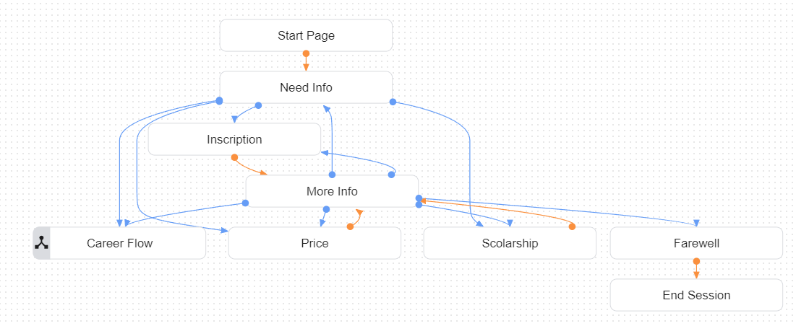
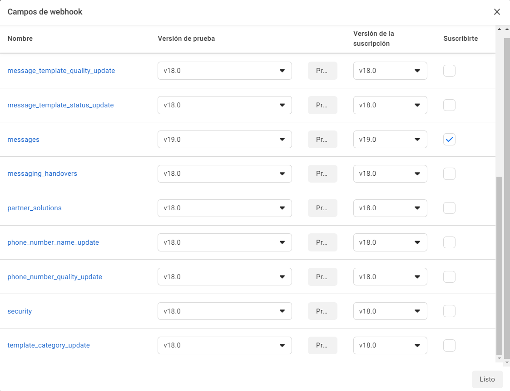
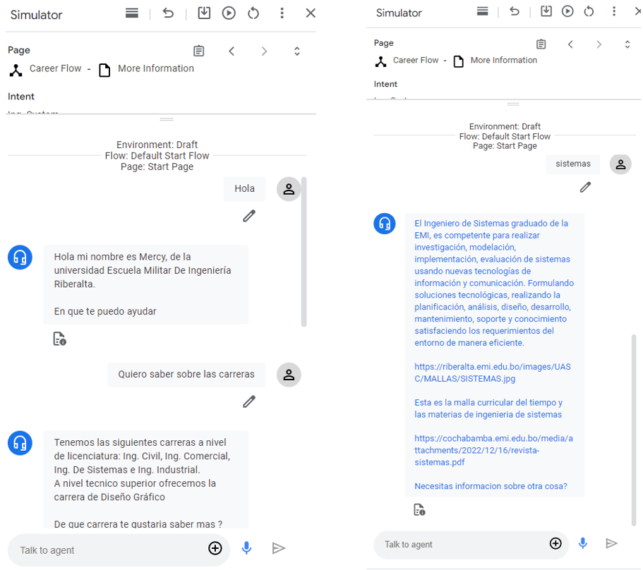
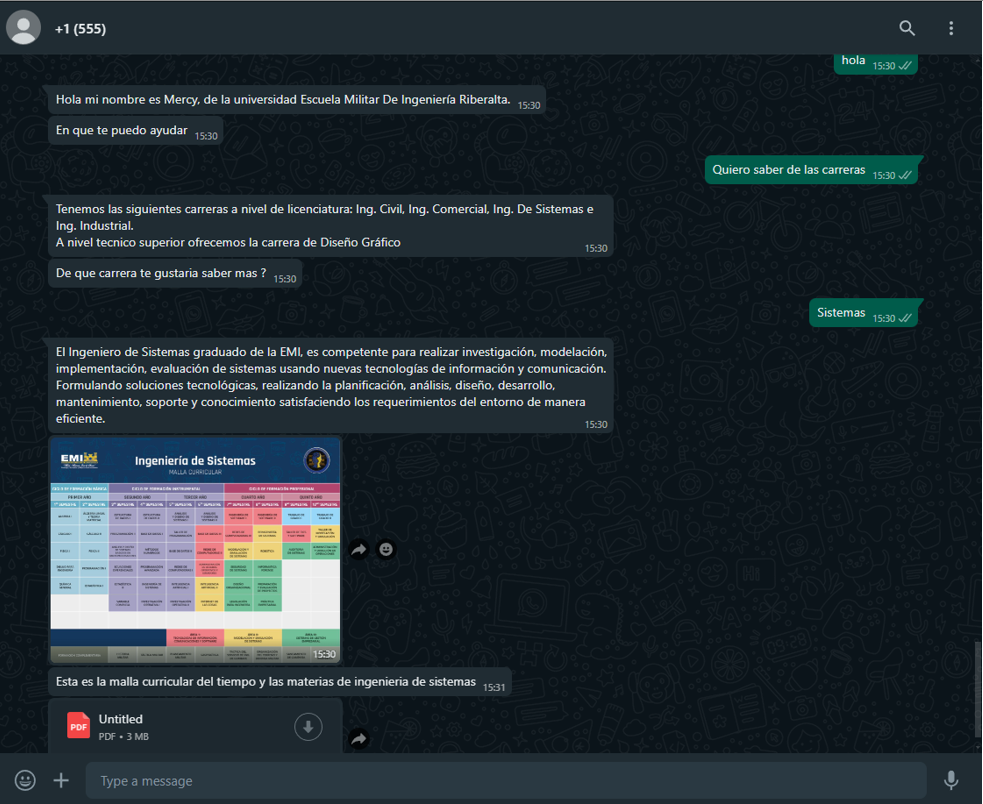

<h1 align="center">WhatsApp Chatbot</h1>


<p align="center">
    <a href="https://www.java.com/es/"></a>
    <a href="https://spring.io/projects/spring-boot"></a>
    <a href="https://www.docker.com/"></a>
    <a href="https://hub.docker.com/_/mongo"></a>
<a href="https://hub.docker.com/_/mongo"></a>
</p>

---
## Description
This project is a WhatsApp chatbot built using Spring Boot and the Dialogflow CX API. The chatbot leverages the powerful conversational capabilities of Dialogflow CX to provide an interactive and responsive user experience on WhatsApp, allowing you to send multimedia messages such as images, videos, files, audios.. This project use the official WhatsApp API from Meta. This bot is applied from a university use case, to request information about a university.

## Table of Contents
- [Previous Set Up](#previous-set-up)
- [Installation](#installation)
- [Usage](#usage)
- [TODO Tasks](#tasks)


## Previous Set Up
### 1. Creating an Agent in Dialogflow CX

To create an agent on Dialogflow CX, start by navigating to the Dialogflow CX Console and signing in with your Google account. Once logged in, you need to create a new project by clicking on the "Select a project" dropdown and choosing "New Project." Enter a name for your project and click "Create" to proceed.

Next, create an agent within this project. In the Dialogflow CX Console, click the "Create Agent" button and fill in the necessary details such as the agent name, default language, and time zone. After providing this information, click "Create" to set up your agent.

With your agent created, the next step is to define its functionality by creating intents and entities. Navigate to the "Intents" section to specify the various intents your chatbot should recognize. Additionally, you can define entities that will help extract and handle data from user inputs more effectively.


*Dialogflow Agent Structure*
### 2. Sign Up To WhatsApp API from Meta
To get access to the WhatsApp API from Meta, begin by visiting the Meta for Developers website and logging in with your Facebook account. Once logged in, create a new Meta app by clicking on "My Apps" in the top right corner and selecting "Create App." Choose the appropriate app type for your needs, such as "Business," and follow the prompts to enter the necessary details like your app name and contact email. Click "Create App ID" to proceed.

After creating your app, you need to add the WhatsApp product to it. In the app dashboard, navigate to the "Add a Product" section on the left sidebar and select "Set Up" under the WhatsApp product. This will guide you through the setup process, which includes creating a WhatsApp Business Account if you don't already have one.

With your WhatsApp Business Account created, the next step is to configure a WhatsApp Business Phone Number. Go to the "Phone Numbers" section under the WhatsApp product settings and click "Add Phone Number." Follow the instructions to verify your number. Once verified, you'll receive a "Phone Number ID" and "WhatsApp Business Account ID," which you'll need for API calls. Don't forget susbribe you to the "message" webhook to allow the bot send and recieve the messages.

To know more about WhatsApp Api from Meta, you can read the [official documentation](https://developers.facebook.com/docs/whatsapp/cloud-api/).


*WhatsApp Message Webhook Subscribe*

### 3. Use AI Model To Improve The Responses (Optional)
This feature was thought to have responses more user friendly and have dynamic responses. You can improve the prompt to get the responses this responses. The prompt is in the `bot.json` file and change it with the bot language. You can choose to use either Chatgpt or Gemini.

## Installation
To set up the project locally  follow these steps:

1. Install gcloud console in your machine to set up your dialogflowcx agent credentials. Follow the instruction [here](http://https://cloud.google.com/sdk/docs/install#windows "here").

2. Create a database on mongoatlas, to save the phone numbers from the users that chat with the bot.

3. Clone the repository to your local machine.
```bash
 git clone https://github.com/rozuke/whatsapp-chatbot-spring-boot
```

4. Navigate to the /src/main/resources and opent the application.properties.

5. Put your credentials in the file. You can remove the credentials that are commenting as optional and delete the corresponding flies that may cause problems.

6. Build the project using Maven.

7. Run the application using the appropriate command.

8. Expose your application to internet, you can use [ngrok](https://ngrok.com/).

9. Register your endpoint on WhatsApp webhook.

## Usage
You can chat with the bot and watch the responses with the "training phrases" that it stablishs in the dialogflowcx agent. To recieve multimedia messages, you only have to put the link to the content in your bucket or any other place where you can save and share the media. Read the documentation about the [format files](http://https://developers.facebook.com/docs/whatsapp/api/messages/message-templates/media-message-templates "format files") that  are compatible with Whatsapp messages.


*Dialogflowcx Agent Interaction*


*WhatsApp Interaction*

## TODO Tasks
1. **Deploy bot:** I tried to deploy on AWS EC2 but I need to have a SSL certificate to register mi app because to to subscribe to the whatsapp webhook you must do it from a secure site with https, for which I need to register a domain.  
